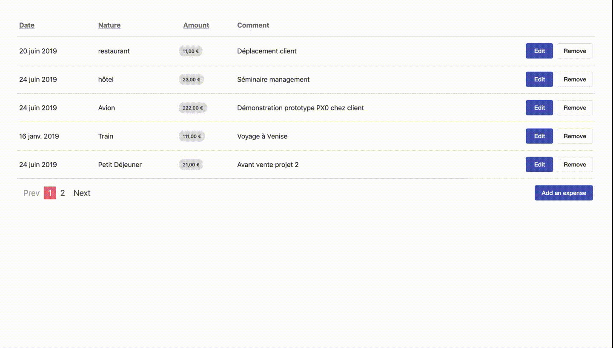

# Expenses

Small and incomplete SPA (Single Page Application) for hiring test.

Object: Using a given API, create a SPA to enter expenses for a business trip.

Missing stuff :

- [ ] Add more tests (only Pagination component is partialy tested)
- [ ] Add i18n
- [ ] Routing could be a good idea (including pagination & edition)



## Getting Started

### Development

With NPM

```
npm install && npm start
```

With yarn

```
yarn && yarn start
```

And open a browser on `http://localhost:4200/`

During development, The API is emulated thanks to [json-server](https://github.com/typicode/json-server)

### Build

Change the token in `environment.prod.ts` for expense api.

With NPM

```
npm run build
```

With yarn

```
yarn build
```

## Running the tests

With NPM

```
npm run test
```

With yarn

```
yarn test
```

## Built With

- [Angular](https://angular.io) - The web framework used
- [Angular CLI](https://cli.angular.io) - Angular CLI
- [Angular Material](https://material.angular.io) - Material Design components for Angular
- [Json-server](https://github.com/typicode/json-server) - Zero config JSON api server

## Authors

- **Thomas Moyse** - [t8g](https://github.com/t8g)

## License

This project is licensed under the MIT License - see the [LICENSE.md](LICENSE.md) file for details
